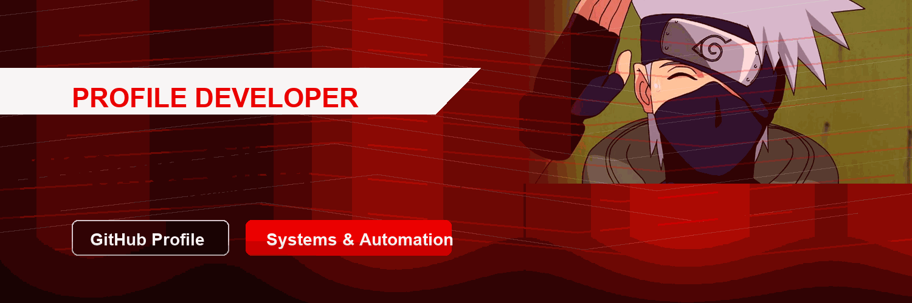

<p align="center">
  
</p>

<p align="center">
  
  
  
</p>

<p align="center">
  
</p>

<br />

## Professional Profile

```txt
CEO | JavaScript Developer | Systems Builder

Specialized in automation, backend scripting, and system integration using JavaScript.
Strong experience with FiveM (vRP) development, Discord bots, APIs, and operational tools.

Focused on creating efficient, scalable solutions that optimize workflows, improve performance, and support digital operations with reliability and precision.
```

<p align="center">
  I build technical solutions with a business mindset: stable systems, automated operations,
  scalable server logic and tools designed to reduce manual work and increase control.
</p>

<p align="center">
  My focus is not just writing scripts. I structure ecosystems: FiveM resources, Discord operations,
  API integrations, internal tooling and interfaces that support real communities and production routines.
</p>

<table>
  <tr>
    <td width="50%">
      <h3 align="center">FiveM vRP Engineering</h3>
      <p align="center">Development of server logic, resources, automations and gameplay systems for roleplay environments.</p>
    </td>
    <td width="50%">
      <h3 align="center">Discord Operations</h3>
      <p align="center">Bots, command structures, moderation workflows, integrations and community management automation.</p>
    </td>
  </tr>
  <tr>
    <td width="50%">
      <h3 align="center">APIs & Internal Tools</h3>
      <p align="center">REST integrations, operational dashboards, data flows and tools built to support decision-making.</p>
    </td>
    <td width="50%">
      <h3 align="center">Performance & Reliability</h3>
      <p align="center">Optimization mindset focused on maintainability, uptime, predictable behavior and scalable execution.</p>
    </td>
  </tr>
</table>

## Executive Strengths

<p align="center">
  
  
  
  
</p>

## Stack

<p align="center">
  
</p>

## GitHub Activity

<p align="center">
  
  
</p>

<p align="center">
  <a href="https://github.com/Wagnersilva1?tab=repositories">
    
  </a>
</p>
