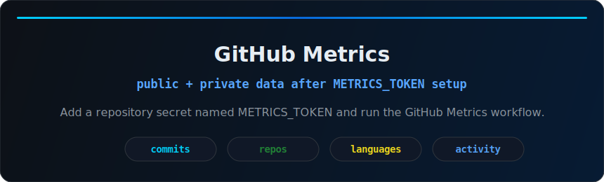

<p align="center">
  
</p>

<p align="center">
  
  
  
</p>

<p align="center">
  
</p>

<br />

## Professional Profile

```txt
CEO | JavaScript Developer
FiveM (vRP) | Discord Bots | APIs | Automation
```

<table>
  <tr>
    <td width="50%">
      <h3 align="center">FiveM vRP</h3>
      <p align="center">Server systems, resources, scripts and workflow automation for roleplay environments.</p>
    </td>
    <td width="50%">
      <h3 align="center">Discord Bots</h3>
      <p align="center">Command systems, integrations, moderation flows and community automation.</p>
    </td>
  </tr>
  <tr>
    <td width="50%">
      <h3 align="center">APIs & Automation</h3>
      <p align="center">Internal tools, REST integrations, data flows and practical automations.</p>
    </td>
    <td width="50%">
      <h3 align="center">Interfaces</h3>
      <p align="center">Dashboards, documentation pages and clean web presentation layers.</p>
    </td>
  </tr>
</table>

## Stack

<p align="center">
  
</p>

## GitHub Metrics

<p align="center">
  
</p>

<p align="center">
  <sub>Private repository data appears here after configuring the repository secret <code>METRICS_TOKEN</code>.</sub>
</p>

## Public Fallback

<p align="center">
  
  
</p>

<p align="center">
  
</p>

<p align="center">
  <a href="https://github.com/Wagnersilva1?tab=repositories">
    
  </a>
</p>
